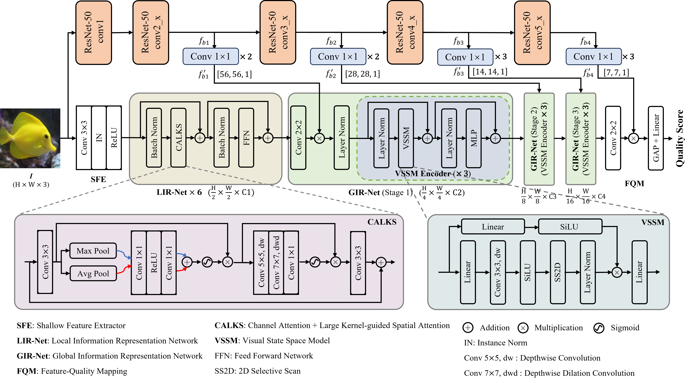
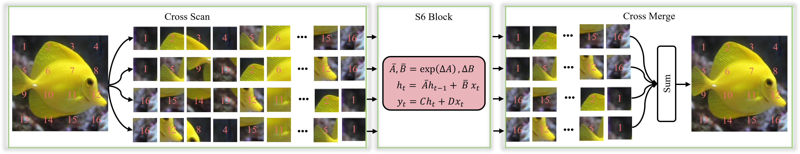

# AMQI

Modified.

## Attention and Mamba-Driven Quality Assessment for Underwater Images

📚[This Paper is waiting publication.](https://ieeexplore.ieee.org) Accepted by IEEE Transactions on Multimedia.

### Architecture of AMQI

<picture>
  
</picture>

### SS2D

<picture>
  
</picture>

### Test prediction code of AMQI
You can download 'AMQI_epoch_10.pth' from [Baidu Netdisk](https://pan.baidu.com/s/1oQAkLSsqu_DgHNGpzGVDYw?pwd=7777).

### Citation

🌟 If you find our work helpful, please leave us a star and cite our paper.

BibTeX
```
Waiting for publication.
```

GB/T 7714
```
Waiting for publication.
```
